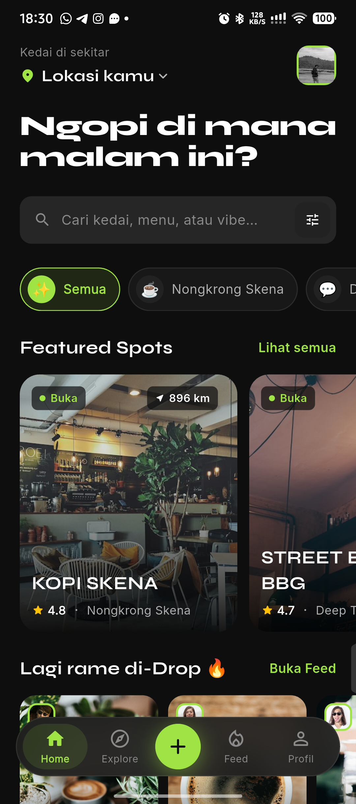
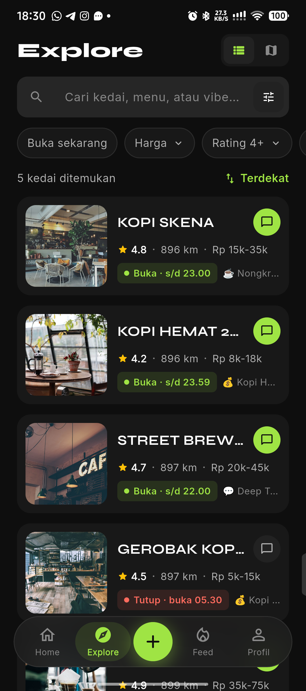
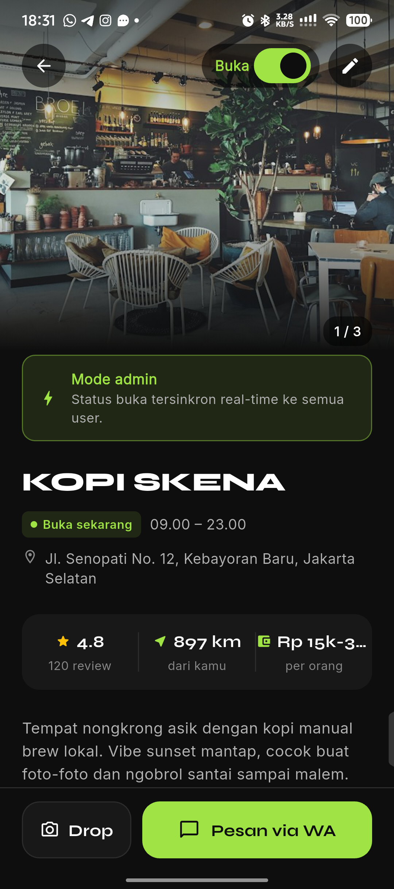
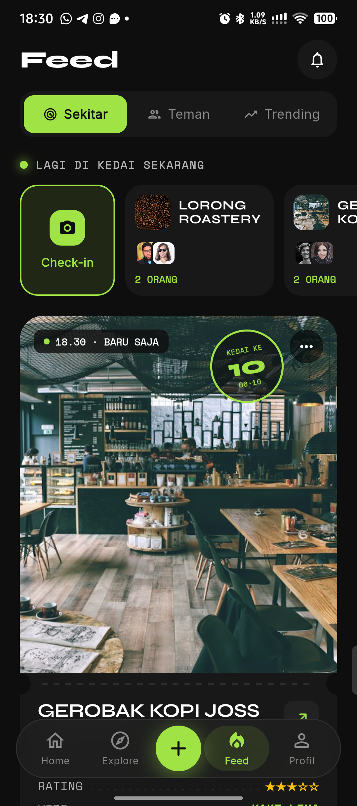
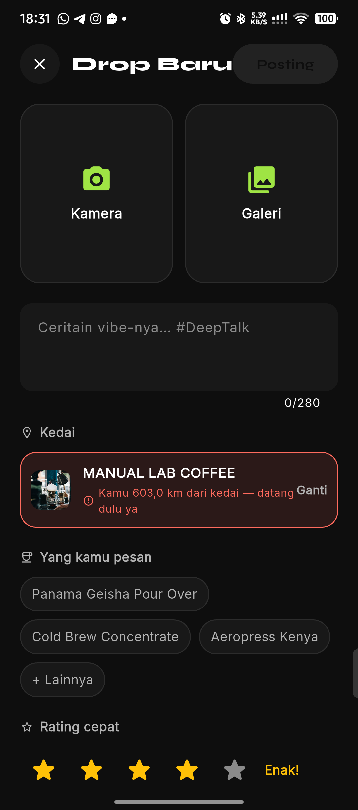
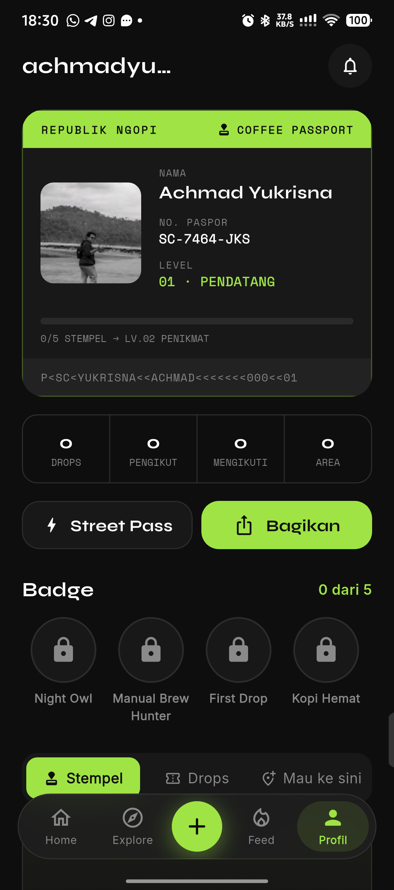

# Street Coffee — Pitch

> **Temukan kopi di skenamu.**
> Peta kedai kopi kaki lima yang *lagi buka*, *harganya masuk*, dan *vibe-nya pas*. Pesan lewat WhatsApp, lalu kumpulkan stempel di Coffee Passport.

Platform: Flutter (Android dulu, iOS menyusul) · Firebase · OpenStreetMap
Status: **MVP v2 jalan di perangkat Android**, 116 test otomatis lulus, beta tertutup Jakarta Selatan direncanakan.
Landing page: [`docs/landing/index.html`](landing/index.html)

---

## 1. Masalah

Kopi enak di kota-kota Indonesia makin banyak dijual di gerobak, garasi, dan pinggir trotoar. Kedai seperti ini murah dan punya karakter, tapi **sulit ditemukan dan sulit dijangkau**.

### 1.1 Dari sisi pembeli (Gen Z, 18–28 th, budget Rp10–30 rb)

| Pain point | Kenyataan di lapangan | Dampak |
|---|---|---|
| **"Masih buka nggak?"** | Jam buka kedai kaki lima jarang tercatat di Google Maps, dan sering berubah (hujan, stok habis) | Datang jauh-jauh, gerobaknya tutup |
| **"Murah nggak?"** | Harga hanya ada di story IG atau menu yang difoto | Ragu mencoba kedai baru |
| **"Vibe-nya cocok?"** | Peta umum tidak membedakan tempat *deep talk*, *nongkrong skena*, atau *kerja* | Pilihan default jatuh ke chain besar |
| **Pesan ribet** | Nomor WA tersebar di bio/story, harus ketik ulang pesanan | Sebagian calon pembeli batal |

### 1.2 Dari sisi kedai (UMKM, 1–3 orang)

| Pain point | Kenyataan di lapangan | Dampak |
|---|---|---|
| **Tidak terlihat online** | Tidak punya website, tidak mampu iklan berbayar | Pelanggan baru hanya dari mulut ke mulut |
| **Order WA tercecer** | Chat masuk dari IG, teman, grup, tanpa tahu sumbernya | Tidak tahu promosi mana yang berhasil |
| **Promo tanpa ukuran** | Diskon diberikan ke siapa saja, tidak tercatat | Margin tergerus tanpa bukti hasil |
| **Aplikasi delivery mahal** | Potongan platform 20–30%, kedai gerobak sering tidak memenuhi syarat | Tidak ada kanal digital yang cocok |

**Akar masalahnya:** tidak ada lapisan informasi *real-time* dan *tepercaya* antara kedai kecil dan pembeli di sekitarnya. Aplikasi peta umum terlalu generik, aplikasi delivery terlalu mahal, dan media sosial terlalu acak.

---

## 2. Solusi

Street Coffee adalah **direktori kedai kopi + lapisan sosial + alat ukur untuk kedai**, dibangun di atas satu loop:

```
Temukan kedai → Pesan via WA (kode SC-XXXX) → Datang & Drop (foto + check-in)
      ↑                                                       ↓
Teman lihat Drop / share card IG Story  ←  Stempel Passport + badge
```

### 2.1 Fitur utama

| | Fitur | Screenshot |
|---|---|---|
| **Temukan** | Home dengan headline "Ngopi di mana malam ini?", vibe chip, Featured Spots, dan daftar "Terdekat dari kamu". Explore dengan filter *Buka sekarang*, harga, rating 4+, vibe, dan fasilitas, plus toggle daftar ⇄ peta (OpenStreetMap, tanpa API key). |   |
| **Pesan** | Detail kedai: status buka *real-time* (dikendalikan pemilik), jam, alamat, rating, jarak, harga, menu favorit, link IG/TikTok/Maps. Tombol **Pesan via WA** membuka sheet konfirmasi berisi pesan siap kirim yang membawa **kode atribusi SC-XXXX**. |  |
| **Drop** | Check-in berbentuk **struk** (foto, kedai, menu & harga, rating, vibe). Feed Sekitar / Teman / Trending, baris "Lagi di kedai sekarang", ☕ Cheers, 📍 Mau ke sini, dan opsi *Tunda lokasi* untuk privasi. |   |
| **Koleksi** | Profil berbentuk **Coffee Passport**: nomor paspor, level (Pendatang → Skena Legend), stempel per kedai, badge (Night Owl, Manual Brew Hunter, First Drop, Kopi Hemat), dan daftar "Mau ke sini". |  |
| **Street Pass** | Langganan user. Promo di kedai partner ditebus dengan **kode 6 karakter yang berganti tiap 30 detik** + QR (anti-screenshot), divalidasi Cloud Function `redeemPromo` di mode kasir. | — |
| **Kedai Pro** | Dashboard pemilik: dilihat, lead WA berkode, lead yang jadi beli, redeem, jam ramai, menu paling sering di-Drop, estimasi omzet dari aplikasi. | — |

> Screenshot diambil dari perangkat Android (Infinix, lebar 360 dp) dengan data seed. Jarak "≈ 896 km" muncul karena perangkat berada jauh dari kedai seed di Jakarta.

### 2.2 Kenapa ini berbeda

| Pembeda | Penjelasan |
|---|---|
| **Fokus kaki lima & skena** | Kategori yang tidak dilayani dengan baik oleh peta umum maupun aplikasi delivery |
| **Status buka dari pemilik** | Toggle buka/tutup tersinkron *real-time* (RTDB), digabung dengan jam operasional |
| **WA tetap jadi kasir** | Tidak memaksa kedai pindah sistem; kode SC-XXXX menjadikan WA terukur |
| **Bahasa visual sendiri** | Struk · Stempel · Paspor, bukan tiruan Instagram. Kontennya dirancang untuk dipamerkan di IG/TikTok, dan app berfungsi sebagai penghasil kontennya |
| **Bukti, bukan janji** | Kedai membayar karena dashboard menunjukkan pelanggan nyata (lead berkode + redeem tervalidasi server) |

---

## 3. Model Bisnis

Prinsip: **fitur sosial gratis selamanya** (paywall di sosial akan mematikan *network effect*). Uang datang dari pihak yang mendapat nilai ekonomi: kedai (pelanggan baru) dan user aktif (promo yang balik modal).

### 3.1 Tiga sumber pendapatan

| Aliran | Pembayar | Harga | Kanal bayar | Nilai yang dijual |
|---|---|---|---|---|
| **Kedai Pro** *(utama)* | Pemilik kedai | Basic **gratis** · Pro **Rp99rb/bln** · Pro+ **Rp249rb/bln** | Web: transfer / QRIS (tanpa potongan store) | Verified badge, promo ke Feed Sekitar, analytics lengkap, partner Street Pass |
| **Street Pass** | User | **Rp19rb/bln** atau **Rp149rb/thn**, trial 7 hari | Google Play Billing / Apple IAP | Promo eksklusif partner, tag ⚡ PASS, frame share card, Coffee Wrapped |
| **Featured bersponsor** | Kedai (bagian Pro+ atau beli terpisah) | Termasuk Pro+ (7 hari/bln); slot tambahan dijual per minggu | Web | Posisi di carousel Home & pin peta, **selalu berlabel "Bersponsor"** |

### 3.2 Mekanisme bagi hasil Street Pass

Diskon promo **ditanggung kedai** (seperti promo biasa), dan sebagai gantinya kedai partner menerima **20% dari pool Street Pass** setelah potongan store, dibagi berdasarkan jumlah redeem tervalidasi (`settleRevenueShare`, tiap tanggal 1).

Ilustrasi per member bulanan:

| Komponen | Rp / member / bulan |
|---|---|
| Harga Street Pass | 19.000 |
| Potongan Google Play (15%) | −2.850 |
| Bersih | 16.150 |
| Pool kedai partner (20%) | −3.230 |
| **Pendapatan Street Coffee** | **≈ 12.920** |

### 3.3 Ilustrasi skala (asumsi, bukan proyeksi)

Satu kota pada bulan ke-12, dengan asumsi konservatif:

| Asumsi | Nilai |
|---|---|
| Kedai terdaftar | 600 |
| Konversi ke Pro / Pro+ | 8% / 2% → 48 / 12 kedai |
| MAU | 25.000 |
| Konversi Street Pass | 3% → 750 member |

| Aliran | MRR |
|---|---|
| Kedai Pro (48 × 99rb) | Rp4,75 jt |
| Kedai Pro+ (12 × 249rb) | Rp2,99 jt |
| Street Pass (750 × ≈12,9rb) | Rp9,69 jt |
| **Total** | **≈ Rp17,4 jt / bulan / kota** |

Angka ini perlu divalidasi saat beta. Metrik yang dipantau: konversi lead WA → beli, redeem per member per bulan (target ≥ 2, supaya Pass terasa balik modal), dan churn Pro setelah 3 bulan.

### 3.4 Struktur biaya utama

- **Firebase** (Firestore read, Storage foto Drop). Mitigasi: kompresi foto ±1080 px, thumbnail, query lokal untuk filter.
- **Tile peta**: OSM publik **tidak boleh** dipakai untuk trafik besar (kebijakan OSMF; flutter_map pun memperingatkannya). Rencana: tile *self-hosted* (Protomaps/PMTiles di CDN) sebelum rilis publik.
- **Potongan store** 15% (Street Pass), **moderasi konten**, dan **akuisisi kedai** (tim lapangan).

---

## 4. Roadmap Pengembangan

### 4.1 Jangka pendek — 0–3 bulan: *Pra-rilis & beta tertutup*

**Tujuan:** aplikasi stabil, 100 kedai di Jakarta Selatan, 1.000 pengguna beta.

| Area | Pekerjaan | Status |
|---|---|---|
| Kualitas | Parsing data toleran, error berbahasa Indonesia, layar izin lokasi, test otomatis (116 test: bloc, widget, parsing) | ✅ selesai |
| Kualitas | Perbaikan form admin: layout section menu, validasi field di luar layar | ✅ selesai |
| Infra | Deploy **Firestore composite index** (Feed & Drops masih "gagal dimuat" di produksi) + security rules + Cloud Functions | ⏳ butuh persetujuan deploy |
| Infra | CI (GitHub Actions: `flutter analyze` + `flutter test` + test rules emulator) | ⏳ |
| Peta | Pindah dari tile OSM publik ke tile self-hosted (PMTiles) | ⏳ wajib sebelum publik |
| Konten | Seed 100 kedai (data terverifikasi lapangan), 300 Drop kurasi agar Feed tidak kosong | ⏳ |
| Kepatuhan | Moderasi (report, blokir, antrean ≤ 24 jam), hapus akun, kebijakan privasi (UU PDP), *Tunda lokasi* default ON | sebagian |
| Rilis | Play Console *closed testing*, landing page + waitlist live | ⏳ |

**KPI keluar fase:** crash-free ≥ 99,5%, retensi D7 ≥ 25%, ≥ 30% sesi berakhir di tap "Pesan via WA".

### 4.2 Jangka menengah — 3–12 bulan: *Monetisasi & ekspansi kota*

**Tujuan:** pendapatan pertama yang berulang, 3 kota.

| Area | Pekerjaan |
|---|---|
| Monetisasi | Aktifkan Kedai Pro (penagihan web + QRIS), Street Pass via Play Billing, settlement bagi hasil bulanan |
| Kedai | Onboarding mandiri "Klaim kedaimu", dashboard Pro, mode kasir, buat promo |
| Sosial | Share card IG Story / TikTok, Coffee Wrapped, leaderboard Regulars, notifikasi push |
| Platform | Rilis iOS (Flutter sudah siap; perlu Apple IAP & review UGC) |
| Data | Rekomendasi "untukmu" berdasarkan vibe, jam, dan riwayat Drop; deteksi jam buka yang tidak akurat dari pola Drop |
| Ekspansi | Bandung & Yogyakarta (kota kampus, budaya kopi kuat), dengan *city launcher* lokal |

**KPI:** 60 kedai berbayar, 2.000 member Pass, MRR ≥ Rp40 jt, churn Pro < 5%/bulan.

### 4.3 Jangka panjang — 12–36 bulan: *Infrastruktur kedai kecil*

**Tujuan:** dari "aplikasi cari kopi" menjadi **lapisan digital untuk ekosistem kedai kecil**.

| Inisiatif | Penjelasan | Sinergi teknis |
|---|---|---|
| **Check-in terverifikasi BLE** | Beacon BLE murah (atau stand QR-NFC) di kedai partner. Stempel & redeem hanya sah bila HP mendeteksi beacon, sehingga tidak bisa dicurangi lewat GPS spoofing | Integrasi BLE/IoT native (Kotlin/Swift) lewat plugin Flutter |
| **Status buka otomatis** | Sensor sederhana (smart plug mesin espresso / tombol fisik "BUKA") mengirim status ke RTDB tanpa pemilik membuka aplikasi | IoT + RTDB presence yang sudah ada |
| **POS ringan untuk gerobak** | Kasir Flutter offline-first: catat order WA berkode, struk, stok harian; data penjualan memperkaya dashboard Pro | Pengalaman POS + Clean Architecture |
| **Pemesanan & bayar di app** | QRIS dinamis per order, *pre-order* sebelum datang; take rate kecil (≤ 3%) sebagai aliran pendapatan ke-4 | — |
| **Data & insight industri** | Laporan tren (menu naik daun, jam ramai per area) untuk roaster, supplier susu/gula aren, dan brand. Data agregat dan anonim | — |
| **Ekspansi regional** | 10+ kota Indonesia, lalu pasar dengan budaya kopi jalanan serupa (Malaysia, Filipina, Vietnam) | — |

**KPI:** 5.000 kedai aktif, 50.000 member Pass, ≥ 30% transaksi partner melewati kode/QRIS Street Coffee.

---

## 5. Risiko & Mitigasi

| Risiko | Skenario | Mitigasi |
|---|---|---|
| **Cold start** | Feed kosong → user pergi; kedai tidak mau bayar karena user sedikit | Fokus satu kecamatan dulu; seed Drop kurasi; Basic gratis agar kedai mau terdaftar sebelum ada user |
| **Data basi** | Status "Buka" salah → kepercayaan hilang | Status = toggle pemilik **dan** dalam jam buka; (rencana) tombol laporan "ternyata tutup"; jangka panjang: sensor IoT |
| **Kecurangan promo** | Screenshot kode, GPS palsu untuk stempel | Kode berputar 30 dtk divalidasi server, 1×/hari/member, radius check-in 150 m; jangka panjang: BLE |
| **Konten negatif** | Drop/komentar menyerang kedai | Report + blokir + antrean moderasi; balasan resmi kedai |
| **Ketergantungan platform** | Kebijakan Play/Apple atau WhatsApp berubah | Kedai Pro dibayar di web; WA hanya jalur, data lead tersimpan di Street Coffee |
| **Biaya infra** | Tagihan Firestore/Storage dan tile peta melonjak | Kompresi foto, cache, filter lokal, tile self-hosted |
| **Pesaing besar** | Google Maps / aplikasi delivery menambah fitur serupa | Kedalaman di segmen kaki lima, komunitas & identitas (Passport), hubungan langsung dengan kedai |

---

## 6. Yang dibutuhkan sekarang

1. **Persetujuan deploy** Firestore index, rules, dan Cloud Functions ke proyek produksi (Feed & Drops bergantung pada ini).
2. **Tile peta self-hosted** sebelum beta publik.
3. **100 kedai pertama** di Jakarta Selatan: survei lapangan, foto, nomor WA, jam buka.
4. **Akun Play Console** untuk closed testing dan produk langganan Street Pass.
